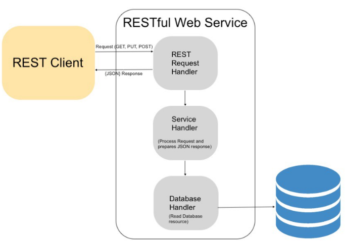
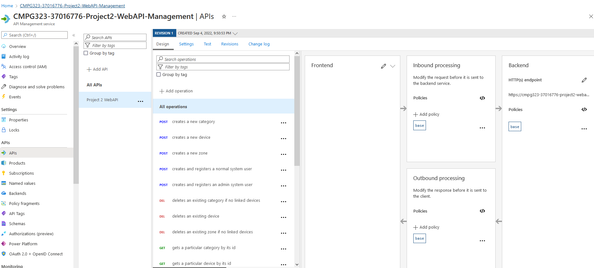
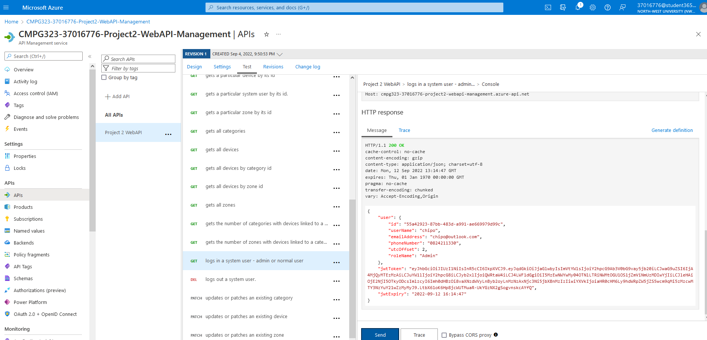

# CMPG 323 Project 3 : IoT Device Management Web APP

### Table of Contents
1. [Introduction](#intro) 
2. [Technology Stack](#tech)
3. [Project Structure and WebAPI Endpoints](#struc)
4. [Azure API Manager](#apiman)
5. [Dependencies](#nuget)
6. [Contributors](#cont)
7. [References](#refs)

## 1. Introduction
This is the third project of the CMPG 323 module deliverables. Smart devices such as voice controllers, security lights, smart locks and Wi-Fi-enabled devices can communicate and exchange data over the Internet. Devices form distributed ecosystems that can perform environmental monitoring of homes and buildings.

IoT device management is defined as the collection of processes, tools, and technologies that help you provision, monitor, and maintain the growing sprawl of connected objects (also called the Internet of Things endpoints or edge devices) in your home or enterprise network

An IoT Device Management System keeps track of the whereabouts of all IoT devices deployed by the organisation. Depending on the type of organisation, different categories of devices are used. Each IoT device is initially categorised and registered. Then, IoT devices are deployed throughout the organisation's buildings in predefined zones. Administrators can view all IoT devices, update their properties, add new devices and move them to other zones.

### 1.1 Entity Information
Therefore, for the complete and satisfactory operations of the IoT Device Management System, the following information is stored in the database about each entity:
* System User
    * User Name (Email Address)
    * Password 

* Category
    * Category ID
    * Category Name
    * Category Description
    * Date and Time Created

* Zone
    * Zone ID
    * Zone Name
    * Zone Description
    * Date and Time Created

* Device
    * Device ID
    * Device Name
    * Category ID
    * Zone ID
    * Status
    * Is Active
    * Date and Time Created

### 1.2 Entity Rules and Restrictions
The above entity information is stored in a relational database. The database tables do not have a complete set of constraints that could prevent or limit, for example the deletion of mandatory information.
Therefore most of the data integrity rules are enforced with the application (WebAPI), and the following are some of the applicable rules:

* System User
    * Must have a non-empty email address
    * Must have a non-empty strong password   

* Category
    * Must have a valid and unique GUID as a category id
    * Must have a non-empty category name
    * Must have a non-empty category description
    * Must have a valid creation date and time 
    * On creation, the category id is checked for uniqueness
    * A category with linked devices can not be deleted

* Zone
    * Must have a valid and unique GUID as a zone id
    * Must have a non-empty zone name
    * Must have a non-empty zone description
    * Must have a valid creation date and time 
    * On creation, the zone id is checked for uniqueness
    * A zone with linked devices can not be deleted

* Device
    * Must have a valid and unique GUID as a device id
    * Must have a non-empty device name
    * Must be assigned to a valid a category
    * Must be assigned to a valid a zone
    * Must have a valid and current status
    * Can be set to be active or not
    * Must have a valid creation date and time 
    * On creation, the zone id is checked for uniqueness
    * On creation or update, the zone id is checked if valid
    * On creation or update, the category id is checked if valid

## 2. Web APP Technology Stack
Representational State Transfer (REST) is a model and architectural style for web services over HTTP. When this model is used for API design, IoT devices can be managed using the Cloud. Therefore, the IoT Device Management System should be implemented as a set of RESTful APIs.
Representational State Transfer (REST) is a model and architectural style for web services over HTTP. When this model is used for API design, IoT devices can be managed using the Cloud. Therefore, the IoT Device Management System should be implemented as a set of RESTful APIs.

The diagram below described a typical client-webapi relationship via a restful service.

<em>image source: https://medium.com/@subhangdxt/beginners-guide-to-client-server-communication-8099cf0ac3af</em>

The archive the above architecture, the following technology stack was employed:
* ASP.NET Core WebAPI using .NET Core
* Swagger and OpenAPI to document the Web API 
* Microsoft SQL Server Database in Azure
* Entity Framework Core for Object Relational Mapping (ORM)
* Microsoft Identity for User management, Authentication and Authorisation
* JSON Web Tokens (JWT) for representing claims securely between client and server.
* Deployment to Microsoft Azure App Service 
* WebAPI management with Microsoft Azure API Management service

## 3. Project Structure and WebAPI Endpoints
The whole solution, named CMPG323.D37016776.Project2.sln, is created using Visual Studio 2019 community edition. The solution only includes a single project, Project2.WebAPI.cproj. The project has the following layers and services:
* Data Access Layer (DAL)
* Business Logic Layer (BLL)
* WebAPI Layer and Presentation via Swagger
* WebAPI Security using JWT
* WebAPI and Database hosting and management in Microsoft Azure

The WebAPI for this project is deployed at https://cmpg323-37016776-project2-webapi.azurewebsites.net. The WebAPI is documented using Swagger and can be accessed and tested at https://cmpg323-37016776-project2-webapi.azurewebsites.net/swagger/index.html. 

Most of the endpoints require an authenticated admin user. You can use the following steps to get access:
* Register as an admin user via swagger the endpoint api/security/register/admin
* Login to get a JWT token via swagger the endpoint api/security/login
* Add the JWT token to the Authorise option on the swagger page
* Run and Test any endpoint and functionality you want.

 The following are the endpoints exposed, grouped per applicable controller:
* CategoryController (api/categories)
    * api/categories/get-all
        * Action: GET
        * Description: Gets all categories
        * Request: None
        * Response: IList<DtoCategory>
        * Authorize: Yes
        * Roles: Admin
    * api/categories/get/{id} 
        * Action: GET
        * Description: Gets a particular category by its id
        * Request: GUID as id
        * Response: DtoCategory
        * Authorize: Yes
        * Roles: Admin
    * api/categories/get-num-of-zones-by-category/{id} 
        * Action: GET
        * Description: Gets the number of zones with devices linked to a category
        * Request: GUID as id
        * Response: number
        * Authorize: Yes
        * Roles: Admin
    * api/categories/create 
        * Action: POST
        * Description: Creates a new category
        * Request: DtoCategory
        * Response: DtoCategory
        * Authorize: Yes
        * Roles: Admin
    * api/categories/update/{id} 
        * Action: PATCH
        * Description: Updates or patches an existing category
        * Request: GUID as id and DtoCategory
        * Response: DtoCategory
        * Authorize: Yes
        * Roles: Admin
    * api/categories/delete/{id} 
        * Action: DELETE
        * Description: Deletes an existing category if no linked devices
        * Request: GUID as id
        * Response: Id of the deleted category
        * Authorize: Yes
        * Roles: Admin

* ZoneController (api/zones)
    * api/zones/get-all
        * Action: GET
        * Description: Gets all zones
        * Request: None
        * Response: IList<DtoZone>
        * Authorize: Yes
        * Roles: Admin
    * api/zones/get/{id} 
        * Action: GET
        * Description: Gets a particular zone by its id
        * Request: GUID as id
        * Response: DtoZone
        * Authorize: Yes
        * Roles: Admin
    * api/zones/get-num-of-categories-by-zone/{id} 
        * Action: GET
        * Description: Gets the number of categories with devices linked to a zone
        * Request: GUID as id
        * Response: number
        * Authorize: Yes
        * Roles: Admin
    * api/zones/create 
        * Action: POST
        * Description: Creates a new zone
        * Request: DtoZone
        * Response: DtoZone   
        * Authorize: Yes
        * Roles: Admin
    * api/categories/update/{id} 
        * Action: PATCH
        * Description: Updates or patches an existing zone
        * Request: GUID as id and DtoZone
        * Response: DtoZone
        * Authorize: Yes
        * Roles: Admin
    * api/zones/delete/{id} 
        * Action: DELETE
        * Description: Deletes an existing zone if no linked devices
        * Request: GUID as id
        * Response: Id of the deleted zone
        * Authorize: Yes
        * Roles: Admin

* DeviceController (api/devices)
    * api/devices/get-all
        * Action: GET
        * Description: Gets all devices
        * Request: GUID as id
        * Response: IList<DtoDevice>
        * Authorize: Yes
        * Roles: Admin
    * api/devices/get-all-by-zone/{zoneId}
        * Action: GET
        * Description: Gets all devices by zone id
        * Request: UID as zone id
        * Response: IList<DtoDevice>
        * Authorize: Yes
        * Roles: Admin
    * api/devices/get-all-by-category/{categoryId}
        * Action: GET
        * Description: Gets all devices by category id
        * Request: UID as category id
        * Response: IList<DtoDevice>
        * Authorize: Yes
        * Roles: Admin
    * api/devices/get/{id} 
        * Action: GET
        * Description: Gets a particular device by its id
        * Request: GUID as id
        * Response: DtoDevice
        * Authorize: Yes
        * Roles: Admin
    * api/devices/create 
        * Action: POST
        * Description: Creates a new device
        * Request: DtoDevice
        * Response: DtoDevice
        * Authorize: Yes
        * Roles: Admin
    * api/devices/update/{id} 
        * Action: PATCH
        * Description: Updates or patches an existing device
        * Request: GUID as id and DtoDevice
        * Response: DtoDevice
        * Authorize: Yes
        * Roles: Admin
    * api/devices/delete/{id} 
        * Action: DELETE
        * Description: Deletes an existing device
        * Request: GUID as id
        * Response: Id of the deleted device
        * Authorize: Yes
        * Roles: Admin

* SecurityController (api/security)
    * api/security/login/{username}/{password}
        * Action: GET
        * Description: Logs in a system user - admin or normal user
        * Request: username and password
        * Response: DtoUserAuthenticationResponse
        * Authorize: No
        * Roles: Any
    * api/security/get/{id} 
        * Action: GET
        * Description: Gets a particular system user by its id
        * Request: GUID as id
        * Response: DtoSystemUser
        * Authorize: Yes
        * Roles: Admin
    * api/security/register/admin 
        * Action: POST
        * Description: Creates and registers an admin system user
        * Request: DtoUserRegistrationRequest
        * Response: DtoUserRegistrationResponse       
        * Authorize: No
        * Roles: Any
    * api/security/register/user 
        * Action: POST
        * Description: Creates and registers a normal system user
        * Request: DtoUserRegistrationRequest
        * Response: DtoUserRegistrationResponse
        * Authorize: No
        * Roles: Any
    * api/security/logout 
        * Action: DELETE
        * Description: Logs out an authenticated user
        * Request: GUID as id
        * Response:String message
        * Authorize: Yes
        * Roles: Any

## 4. Azure API Manager
The image below is a screenshot of the API endpoints under the Azure API manager.

The image below is a screenshot of a test done under the Azure API manager for the login endpoint, api/security/login/{username}/{password}.

## 5. Dependencies
The following nuget packages are referenced by the Project2.WebAPI project.

 | Package  |  Version  |  License  |
 | ---  |  ---  |  ---  |
 | [Microsoft.AspNetCore.Authentication.JwtBearer](https://www.nuget.org/packages/Microsoft.AspNetCore.Authentication.JwtBearer/3.1.28/)  |  3.1.28  |  [Apache 2.0](https://licenses.nuget.org/Apache-2.0)  |
 | [Microsoft.AspNetCore.Identity](https://www.nuget.org/packages/Microsoft.AspNetCore.Identity/2.2.0/)  |  2.2.0  |  [Apache 2.0](https://licenses.nuget.org/Apache-2.0)  |
 | [Microsoft.AspNetCore.Identity.EntityFrameworkCore](https://www.nuget.org/packages/Microsoft.AspNetCore.Identity.EntityFrameworkCore/3.1.28/)  |  3.1.28  |  [Apache 2.0](https://licenses.nuget.org/Apache-2.0)  |
 | [Microsoft.EntityFrameworkCore](https://www.nuget.org/packages/Microsoft.EntityFrameworkCore/3.1.28/)  |  3.1.28  |  [Apache 2.0](https://licenses.nuget.org/Apache-2.0)  |
 | [Microsoft.EntityFrameworkCore.Design](https://www.nuget.org/packages/Microsoft.EntityFrameworkCore.Design/3.1.28/)  |  3.1.28  |  [Apache 2.0](https://licenses.nuget.org/Apache-2.0)  |
 | [Microsoft.EntityFrameworkCore.SqlServer](https://www.nuget.org/packages/Microsoft.EntityFrameworkCore.SqlServer/3.1.28/)  |  3.1.28  |  [Apache 2.0](https://licenses.nuget.org/Apache-2.0)  |
 | [Microsoft.EntityFrameworkCore.Tools](https://www.nuget.org/packages/Microsoft.EntityFrameworkCore.Tools/3.1.28/)  |  3.1.28  |  [Apache 2.0](https://licenses.nuget.org/Apache-2.0)  |
 | [Microsoft.OpenApi](https://www.nuget.org/packages/Microsoft.OpenApi/1.3.2/)  |  1.3.2  |  [Apache 2.0](https://licenses.nuget.org/Apache-2.0)  |
 | [Swashbuckle.AspNetCore](https://www.nuget.org/packages/Swashbuckle.AspNetCore/6.4.0/)  |  6.4.0  |  [Apache 2.0](https://licenses.nuget.org/Apache-2.0)  |

## 6. Contributors
* [Chipo Hamayobe (37016776)](https://github.com/ChiefMonk) - Project Lead

## 7. References
### ASP.NET Core MVC
* [Get started with ASP.NET Core MVC](https://learn.microsoft.com/en-us/aspnet/core/tutorials/first-mvc-app/start-mvc?view=aspnetcore-6.0&tabs=visual-studio)
* [Build web apps with ASP.NET Core for beginners](https://learn.microsoft.com/en-us/training/paths/aspnet-core-web-app/)
* [Choose an ASP.NET Core web UI](https://learn.microsoft.com/en-us/aspnet/core/tutorials/choose-web-ui?view=aspnetcore-6.0)
* [Tutorial: Get started with Razor Pages in ASP.NET Core](https://learn.microsoft.com/en-us/aspnet/core/tutorials/razor-pages/razor-pages-start?view=aspnetcore-6.0&tabs=visual-studio)
* [Overview of ASP.NET Core MVC](https://learn.microsoft.com/en-us/aspnet/core/mvc/overview?view=aspnetcore-6.0)
* [ASP.NET MVC Overview](https://learn.microsoft.com/en-us/aspnet/mvc/overview/older-versions-1/overview/asp-net-mvc-overview)
* [Secure a .NET web app with the ASP.NET Core Identity framework](https://learn.microsoft.com/en-us/training/modules/secure-aspnet-core-identity)
* [Model in ASP.NET MVC](https://www.tutorialsteacher.com/mvc/mvc-model)
* [CMPG-323-IOT-Device-Management](https://github.com/JacquiM/CMPG-323-IOT-Device-Management)

### Design Patterns
* [Architectural principles](https://learn.microsoft.com/en-us/dotnet/architecture/modern-web-apps-azure/architectural-principles#separation-of-concerns) 
* [Common web application architectures](https://learn.microsoft.com/en-us/dotnet/architecture/modern-web-apps-azure/common-web-application-architectures)
* [Architectural Patterns in .NET](https://www.c-sharpcorner.com/uploadfile/babu_2082/architectural-patterns-in-net/)
* [Dependency injection in ASP.NET Core](https://docs.microsoft.com/en-us/aspnet/core/fundamentals/dependency-injection?view=aspnetcore-3.1) 
* [C# Design Patterns](https://www.dofactory.com/net/design-patterns)
* [Design Patterns In C# .NET](https://www.c-sharpcorner.com/UploadFile/bd5be5/design-patterns-in-net/)

### Repository Pattern
* [Implementing the Repository and Unit of Work Patterns in an ASP.NET MVC Application](https://learn.microsoft.com/en-us/aspnet/mvc/overview/older-versions/getting-started-with-ef-5-using-mvc-4/implementing-the-repository-and-unit-of-work-patterns-in-an-asp-net-mvc-application)
* [Repository Pattern in ASP.NET Core – Ultimate Guide](https://codewithmukesh.com/blog/repository-pattern-in-aspnet-core/)
* [Repository Design Pattern in C# with Examples](https://dotnettutorials.net/lesson/repository-design-pattern-csharp/)
* [ASP.NET Core Web API – Repository Pattern](https://code-maze.com/net-core-web-development-part4/)
* [Repository Pattern in ASP.NET Core REST API](https://www.pragimtech.com/blog/blazor/rest-api-repository-pattern/)
* [Repository Pattern Implementation in ASP.NET Core](https://medium.com/net-core/repository-pattern-implementation-in-asp-net-core-21e01c6664d7)

### Microsoft Azure
* [Microsoft Azure Fundamentals: Describe cloud concepts](https://docs.microsoft.com/en-us/learn/paths/microsoft-azure-fundamentals-describe-cloud-concepts/)
* [The development process for Azure](https://learn.microsoft.com/en-us/dotnet/architecture/modern-web-apps-azure/development-process-for-azure)
* [Azure hosting recommendations for ASP.NET Core web apps](https://learn.microsoft.com/en-us/dotnet/architecture/modern-web-apps-azure/azure-hosting-recommendations-for-asp-net-web-apps)
* [Web App for Containers](https://azure.microsoft.com/en-us/products/app-service/containers/#overview)
* [Azure App Service](https://azure.microsoft.com/en-us/products/app-service/#overview)

